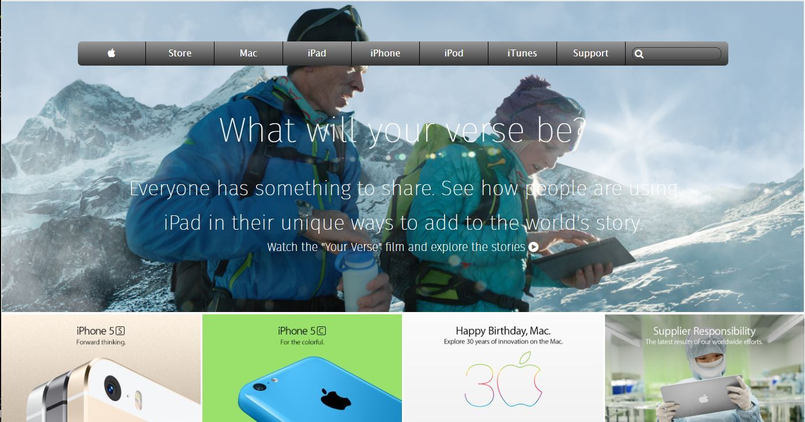

## Apple Website Page

This is a clone of Apple Website Page, a part of the technical curriculum projects in Microverse.

## Built With

- HTML
- CSS

## Live Demo

[Live Demo Link](https://rawcdn.githack.com/Abidoyinsola1/apple-website-page/b09bc29aa8eb9cc1fd6cbc91c9b15e03ee02154a/index.html
)

## Author

👤 **Somoye Ayotunde Peter**

- Github: [@somoye123](https://github.com/somoye123)
- Twitter: [@twitterhandle](https://twitter.com/ayotunde_197)
- LinkedIn: [LinkedIn](https://www.linkedin.com/in/somoye-ayotunde-03a471161)

👤 **Abiola Doyinsola Adeyemi**

- Github: [@githubhandle](https://github.com/abidoyinsola1)
- Twitter: [@twitterhandle](https://twitter.com/abidoyinsola)
- LinkedIn: [LinkedIn](https://www.linkedin.com/in/doyinsola-adeyemi)

## 🤝 Contributing

Contributions, issues and feature requests are welcome!

## Show your support

Give a ⭐️ if you like this project!
